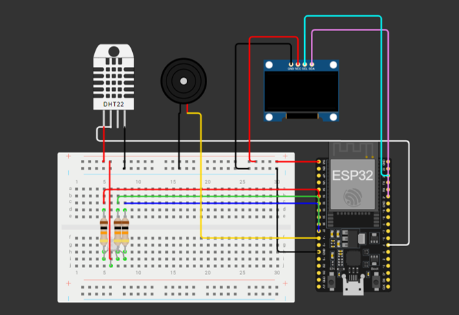

# IoT-Based Smart Egg Incubator: Real-Time Temperature Monitoring System

> **Project Description:** An automated, real-time temperature monitoring system built with ESP32 to optimize chicken egg hatching success rates through dynamic audio-visual alerts and external weather API integration.


### 🚀 Quick Links
* **📂 Source Code:** `[Click Here to View Code]` (Link to your src/ folder)
* **📺 Video Demonstration:** `[Click Here to Watch Video]` (Link to YouTube/Drive)

---

## 📌 1. Background & The Challenge
Temperature stability plays a critical role in the success of chicken egg incubation. Fluctuations outside the safe range can disrupt embryo development, leading to hatching failure. 
* **The Problem:** Many local poultry farmers still rely on conventional, manual incubators lacking automated monitoring systems. This forces them to constantly check conditions manually—a process highly inefficient and prone to human error.
* **The Solution:** This project introduces a low-cost, smart IoT device that monitors internal incubator temperature using physical sensors while fetching external ambient data from a cloud API. It provides instant, automated visual and audio alerts to help farmers mitigate risks immediately.

---

## 🛠️ 2. Tech Stack & Components
* **Core Microcontroller:** ESP32 (Wi-Fi Module)
* **Sensors & Input:** DHT11 Temperature Sensor
* **Outputs & Indicators:** 0.96" OLED Display (I2C), RGB LED, Active Buzzer
* **Data Parsing & Cloud Service:** OpenWeatherMap API, ArduinoJson
* **Development Environment:** Arduino IDE (C++)

---

## 📐 3. System Architecture & Conditional Logic
The system is built upon a 3-layer IoT architecture (Perception, Network, and Application layers)[cite: 2]. The ESP32 continuously processes internal hardware data and fetches outdoor weather parameters simultaneously via Wi-Fi[cite: 2].

### Hardware Connection Wiring (Pin Mapping)
* **DHT11 Sensor:** Connected to GPIO 4[cite: 2]
* **RGB LED:** Connected via 10Ω resistors to Red (GPIO 25), Green (GPIO 26), Blue (GPIO 27)[cite: 2]
* **Active Buzzer:** Connected to GPIO 14[cite: 2]
* **OLED Display:** I2C Communication on GPIO 22 (SCL) & GPIO 23 (SDA)[cite: 2]



### Logic Control & Threshold Breakdown
The firmware utilizes multi-level conditional `if-else` logic to categorize environmental safety states based on scientific incubation parameters[cite: 2]:

| Temperature Range (°C) | System Status | Visual Indicator (RGB LED) | Audio Alert (Buzzer) |
| :--- | :--- | :--- | :--- |
| **< 36.0°C** | Non-optimal (Too Cold) | 🔵 Blue Light ON[cite: 2] | 🔊 Active Alarm[cite: 2] |
| **36.0°C - 36.9°C** | Suboptimal (Slightly Low) | 🟡 Yellow Light ON[cite: 2] | 🔇 OFF[cite: 2] |
| **37.0°C - 38.0°C** | **Optimal (Ideal Temperature)** | 🟢 Green Light ON[cite: 2] | 🔇 OFF[cite: 2] |
| **38.1°C - 38.9°C** | Suboptimal (Slightly High) | 🟡 Yellow Light ON[cite: 2] | 🔇 OFF[cite: 2] |
| **≥ 39.0°C** | Non-optimal (Too Hot) | 🔴 Red Light ON[cite: 2] | 🔊 Active Alarm[cite: 2] |

---

## 💻 4. Core Implementation Highlight
Below is the core implementation snippet showcasing how the ESP32 performs HTTP GET requests to retrieve real-time outdoor temperature payloads using JSON deserialization[cite: 2]:

```cpp
float getOutdoorTemp() {
  if (WiFi.status() == WL_CONNECTED) {
    HTTPClient http;
    String url = "[http://api.openweathermap.org/data/2.5/weather?q=Samarinda&appid=YOUR_API_KEY&units=metric](http://api.openweathermap.org/data/2.5/weather?q=Samarinda&appid=YOUR_API_KEY&units=metric)";
    http.begin(url);
    int httpCode = http.GET();
    
    if (httpCode == 200) {
      String payload = http.getString();
      DynamicJsonDocument doc(1024);
      deserializeJson(doc, payload);
      float temp = doc["main"]["temp"];
      http.end();
      return temp;
    } else {
      http.end();
      return NAN;
    }
  }
  return NAN;
}
